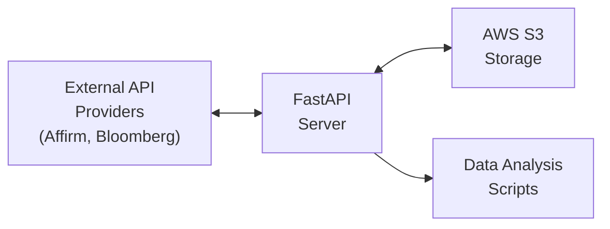
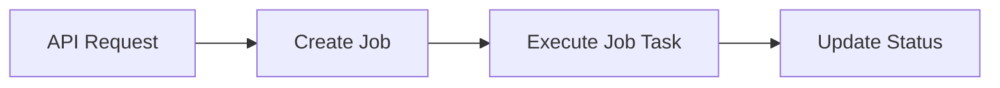

# System Overview

## Introduction

The Octo project is a data processing system designed to automate the retrieval, decryption, and storage of financial data from various providers like Affirm and Bloomberg. The system is built around a FastAPI server that manages asynchronous jobs to process files from these providers.

## System Architecture

The system consists of the following key components:

1. **FastAPI Server**: The core of the system, handling API requests, authentication, and job management.
2. **Provider System**: Handles connections to external data providers (Affirm, Bloomberg) via SFTP.
3. **File Processing Pipeline**: Manages the download, decryption, decompression, and upload of files.
4. **AWS S3 Integration**: Stores processed files in an organized structure.
5. **Data Analysis Scripts**: Various Python and Jupyter notebook scripts for analyzing the financial data.

## Key Workflows

### Main Data Processing Workflow

1. The server connects to the provider's SFTP server
2. Files are downloaded from the provider
3. Files are decrypted (if encrypted with GPG)
4. Files are processed (unzipped, transformed as needed)
5. Processed files are uploaded to AWS S3 for storage and further analysis

### API Job Management Workflow

1. API receives a request to process files from a specific provider
2. A job is created and tracked in the system
3. The job is executed as a background task
4. Job status is updated as processing progresses

## Technology Stack

- **Backend Framework**: FastAPI
- **Authentication**: OAuth2 with API key authentication
- **Asynchronous Processing**: Python asyncio
- **File Transfer**: Paramiko (SSH/SFTP)
- **File Encryption**: GnuPG
- **Cloud Storage**: AWS S3
- **Data Analysis**: Python, Pandas, NumPy, etc.

## Deployment

The system is designed to be deployed on an AWS EC2 instance using Docker. The SETUP.MD file provides detailed instructions for setting up the environment.

## Next Steps

For more detailed information about specific components, refer to the following documents:

- [FastAPI Server Architecture](./02-fastapi-architecture.md)
- [Design Patterns](./03-design-patterns.md)
- [Provider System](./04-provider-system.md)
