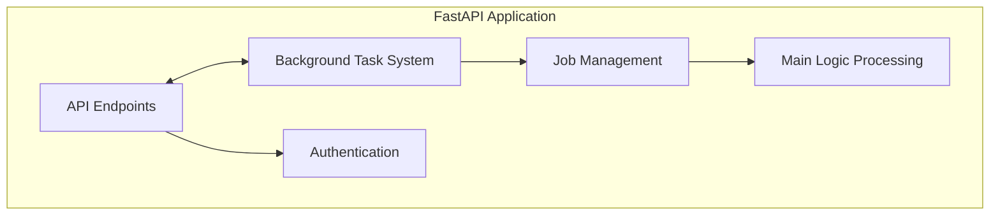
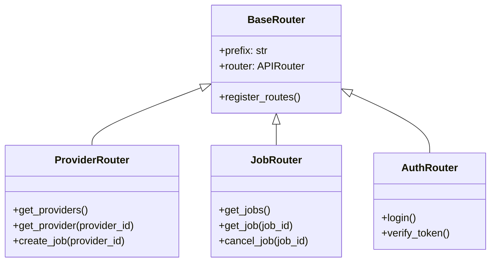
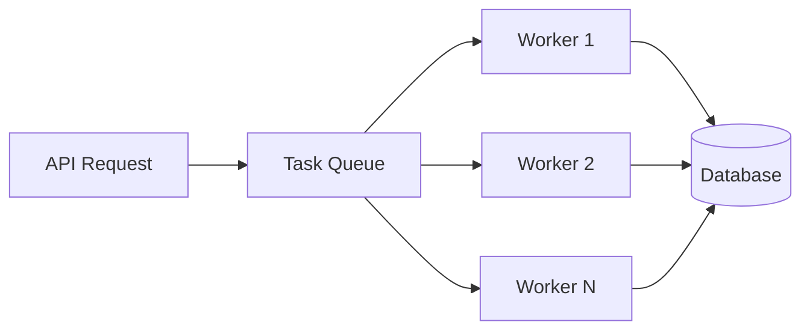
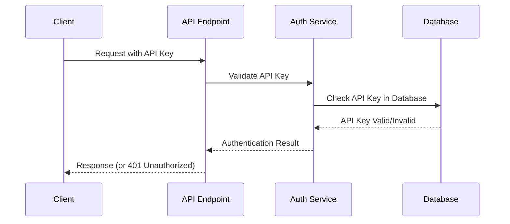

# FastAPI Server Architecture

## Introduction

The FastAPI server is the central component of the Octo system, providing a modern, high-performance API for triggering and managing data processing jobs. This document details the architecture and implementation of the FastAPI server.

## Server Structure

The FastAPI application is organized into several interconnected components:

1. **API Endpoints**: RESTful endpoints for client interactions
2. **Background Task System**: Manages asynchronous job execution
3. **Authentication**: Handles API key verification and access control
4. **Job Management**: Tracks and controls job execution state
5. **Main Logic Processing**: Implements the core business logic

## Endpoint Structure

The API endpoints are organized into router classes that inherit from a common base router:

1. **ProviderRouter**: Handles provider-related operations
2. **JobRouter**: Manages job operations (listing, retrieval, cancellation)
3. **AuthRouter**: Handles authentication operations

## Background Tasks

The background task system uses asyncio to manage concurrent job execution:

1. API requests trigger the creation of background tasks
2. Tasks are queued and executed by worker processes
3. Workers update the database with status information
4. The system is designed to be scalable with multiple workers

## Authentication Flow

The authentication system uses API keys for secure access:

1. Clients send an API key with each request
2. The API endpoint forwards the key to the authentication service
3. The service checks the key against the database
4. If valid, the request proceeds; otherwise, an unauthorized response is returned

## Data Models

The system uses Pydantic models for data validation and SQLAlchemy models for database interactions.

## Exception Handling

The server implements a global exception handler that catches all exceptions and returns appropriate HTTP responses.

## Configuration

The server uses environment variables and configuration files to define runtime behavior.
