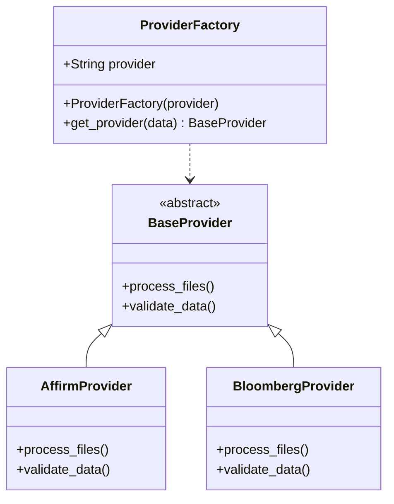
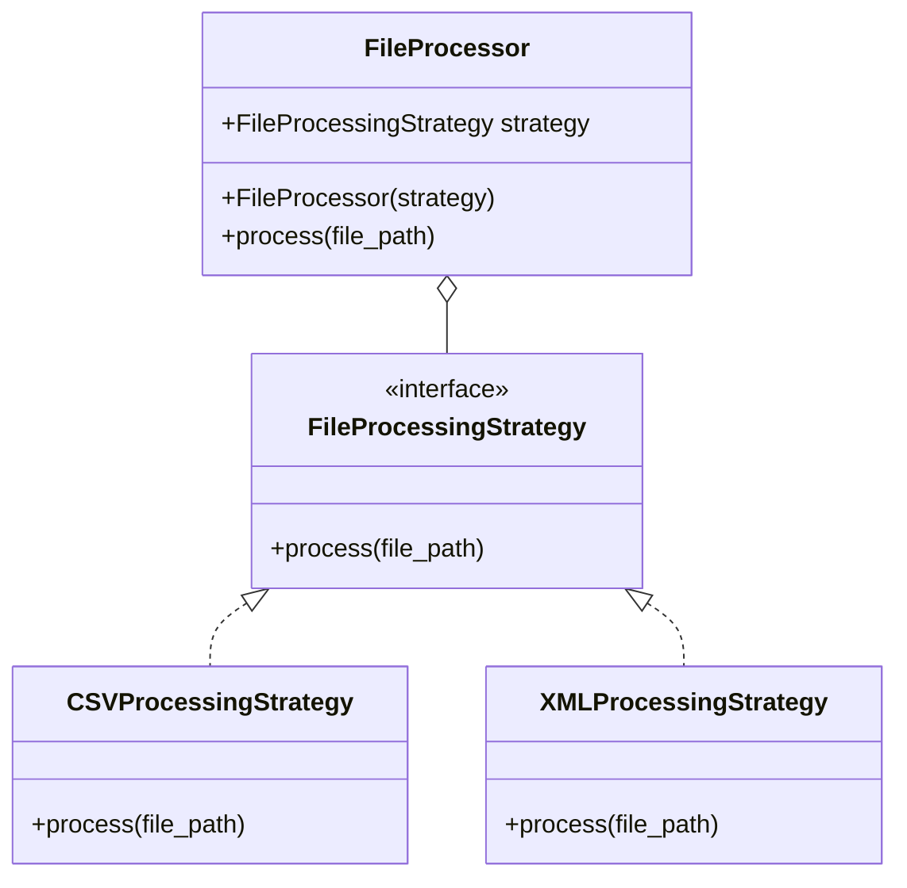
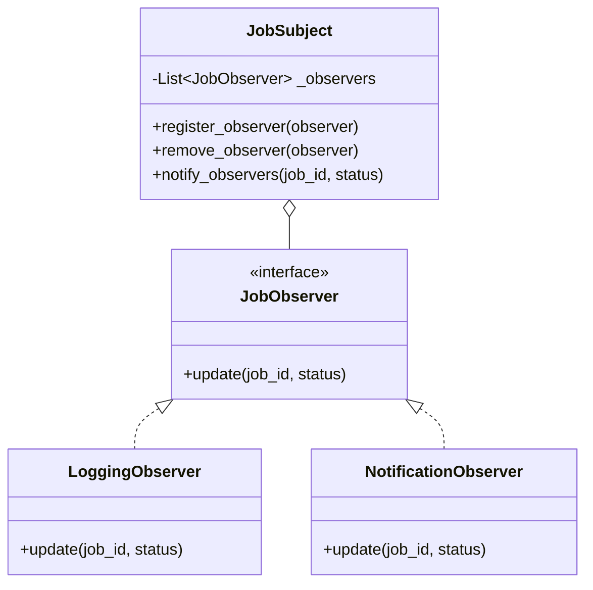
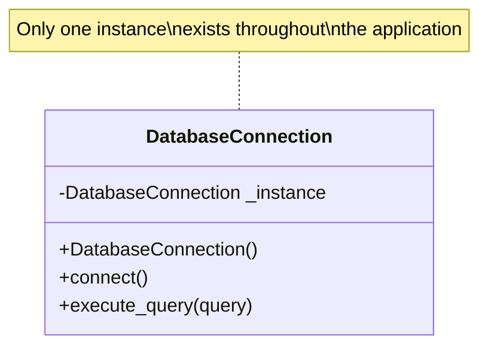
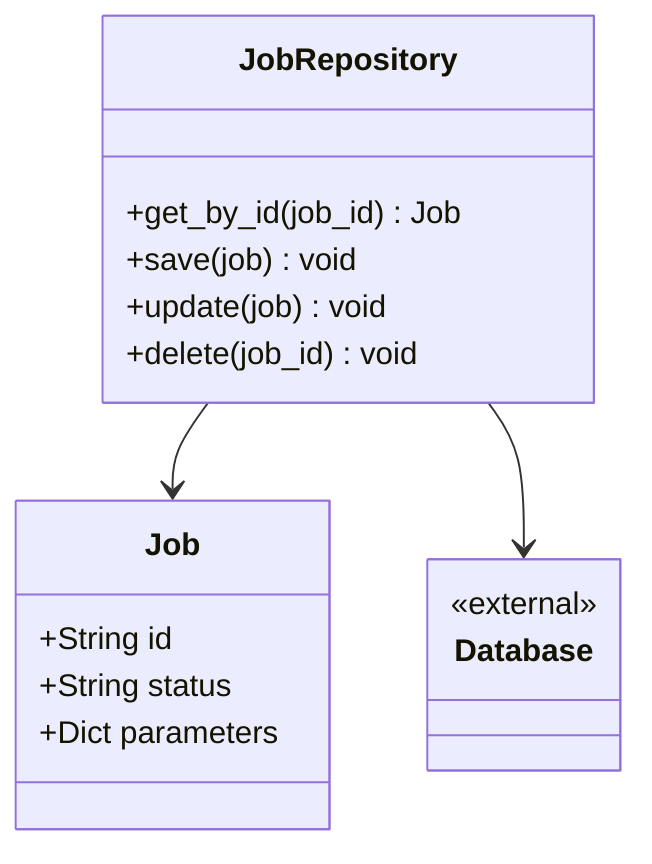

# Design Patterns

## Introduction

The Octo FastAPI server implementation uses several design patterns to achieve a clean, maintainable architecture. This document outlines the key design patterns used in the system and explains how they contribute to the overall architecture.

## Factory Pattern

### Implementation

The Factory Pattern is used to create provider-specific handlers through the `ProviderFactory` class:

```python
class ProviderFactory():
  def __init__(self, provider):
    self.provider = provider
  def get_provider(self, data) -> BaseProvider | None:
    if self.provider == "affirm":
      from src.core.providers.affirm import AffirmProvider
      return AffirmProvider(data)
    elif self.provider == "bloomberg":
      from src.core.providers.bloomberg import BloombergProvider
      return BloombergProvider(data)
    else:
      return None
```

### Usage

The factory is used in the main logic to create the appropriate provider instance:

```python
providerObject = ProviderFactory(provider_str)
provider = providerObject.get_provider(data)
```

### Benefits

- **Encapsulation**: Hides the complexity of provider creation
- **Extensibility**: New providers can be added by extending the factory without modifying client code
- **Conditional Loading**: Only imports the necessary provider modules when needed

### Diagram



## Strategy Pattern

### Implementation

The Strategy Pattern is used for file processing strategies:

```python
class FileProcessor:
    def __init__(self, strategy: FileProcessingStrategy):
        self.strategy = strategy

    def process(self, file_path):
        return self.strategy.process(file_path)

class FileProcessingStrategy(ABC):
    @abstractmethod
    def process(self, file_path):
        pass

class CSVProcessingStrategy(FileProcessingStrategy):
    def process(self, file_path):
        # CSV specific processing
        pass

class XMLProcessingStrategy(FileProcessingStrategy):
    def process(self, file_path):
        # XML specific processing
        pass
```

### Usage

```python
# For CSV files
processor = FileProcessor(CSVProcessingStrategy())
processor.process("data.csv")

# For XML files
processor = FileProcessor(XMLProcessingStrategy())
processor.process("data.xml")
```

### Benefits

- **Decoupling**: Separates the file processing algorithm from the client code
- **Flexibility**: Allows switching strategies at runtime
- **Organized Code**: Each strategy is encapsulated in its own class

### Diagram



## Observer Pattern

### Implementation

The Observer Pattern is used for job status notifications:

```python
class JobSubject:
    def __init__(self):
        self._observers = []

    def register_observer(self, observer):
        self._observers.append(observer)

    def remove_observer(self, observer):
        self._observers.remove(observer)

    def notify_observers(self, job_id, status):
        for observer in self._observers:
            observer.update(job_id, status)

class JobObserver(ABC):
    @abstractmethod
    def update(self, job_id, status):
        pass

class LoggingObserver(JobObserver):
    def update(self, job_id, status):
        logging.info(f"Job {job_id} status: {status}")

class NotificationObserver(JobObserver):
    def update(self, job_id, status):
        # Send notification
        pass
```

### Usage

```python
job_subject = JobSubject()
job_subject.register_observer(LoggingObserver())
job_subject.register_observer(NotificationObserver())

# When job status changes
job_subject.notify_observers("job-123", "completed")
```

### Benefits

- **Loose Coupling**: Subjects don't need to know about observers
- **Broadcast Communication**: One-to-many notification
- **Dynamic Relationships**: Observers can be added/removed at runtime

### Diagram



## Singleton Pattern

### Implementation

The Singleton Pattern is used for database connection management:

```python
class DatabaseConnection:
    _instance = None

    def __new__(cls):
        if cls._instance is None:
            cls._instance = super().__new__(cls)
            cls._instance.connect()
        return cls._instance

    def connect(self):
        # Initialize connection
        pass
```

### Usage

```python
# Both variables reference the same instance
db1 = DatabaseConnection()
db2 = DatabaseConnection()
```

### Benefits

- **Resource Efficiency**: Prevents multiple instances of resource-heavy objects
- **Global Access**: Provides a global access point to the instance
- **Consistent State**: Ensures consistent state across the application

### Diagram



## Repository Pattern

### Implementation

The Repository Pattern is used for data access abstraction:

```python
class JobRepository:
    def get_by_id(self, job_id):
        # Retrieve job from database
        pass

    def save(self, job):
        # Save job to database
        pass

    def update(self, job):
        # Update job in database
        pass

    def delete(self, job_id):
        # Delete job from database
        pass
```

### Usage

```python
job_repo = JobRepository()
job = job_repo.get_by_id("job-123")
job.status = "completed"
job_repo.update(job)
```

### Benefits

- **Abstraction**: Hides data access details
- **Testability**: Easy to mock for unit testing
- **Data Access Centralization**: Central place for data access logic

### Diagram


