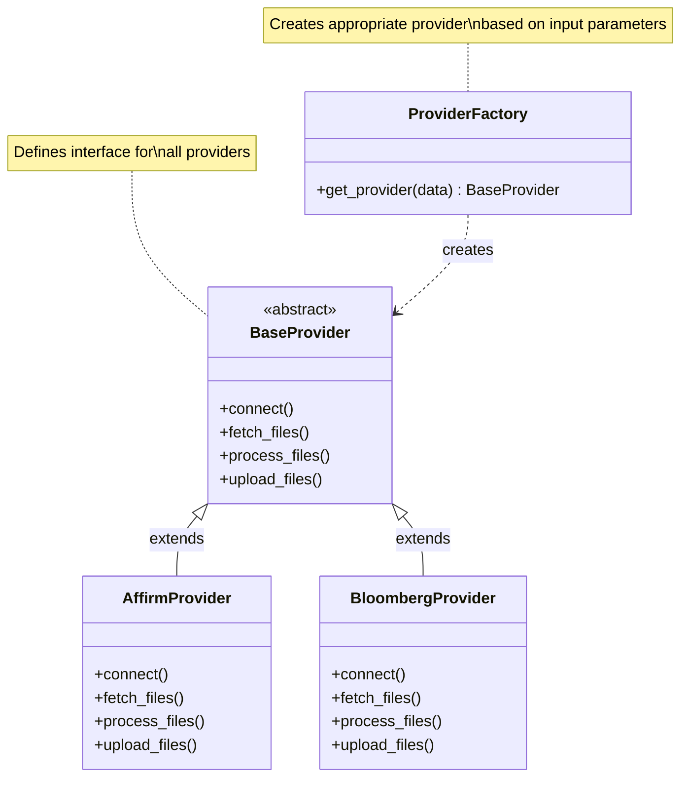
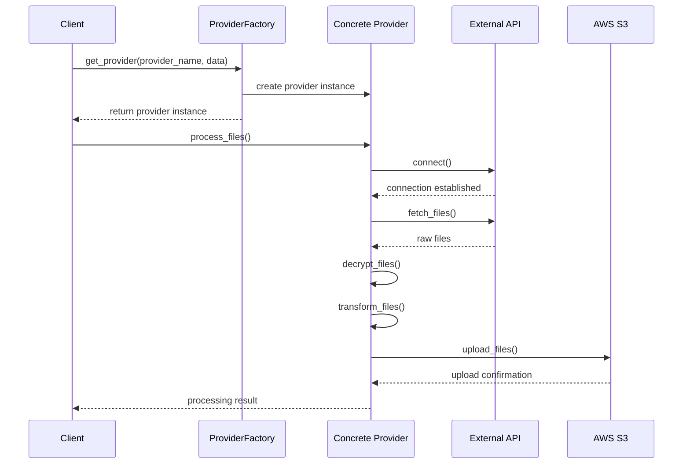
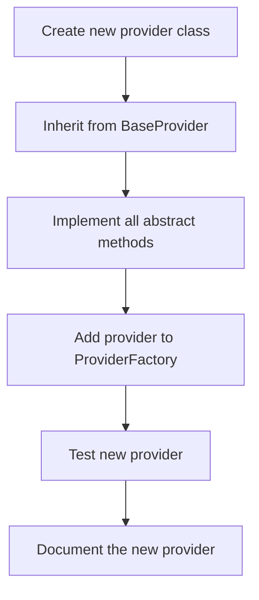
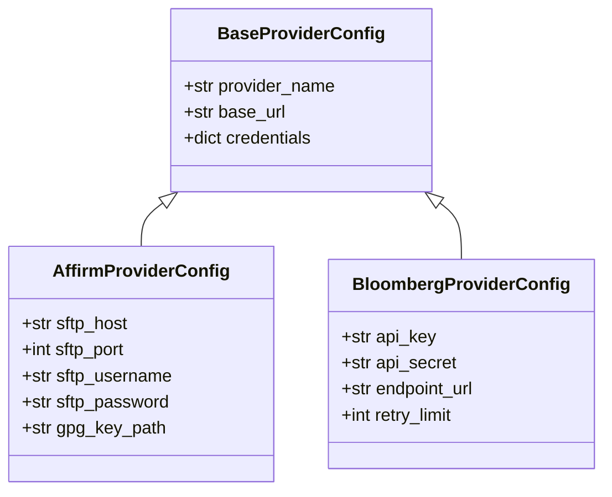
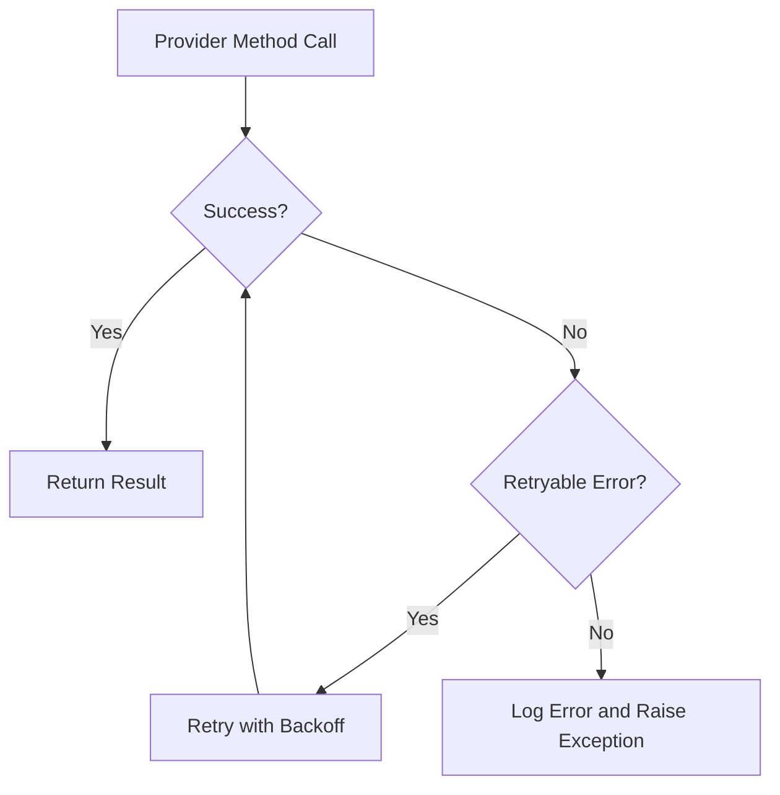

# Provider System

## Introduction

The Provider System is a core component of the Octo application, responsible for handling the interaction with different data providers such as Affirm and Bloomberg. This document details the architecture of the Provider System, how it works, and how to extend it with new providers.

## System Architecture



The Provider System consists of several key components:

1. **ProviderFactory**: Creates instances of specific providers based on input parameters
2. **BaseProvider**: An abstract class defining the interface for all providers
3. **Concrete Providers**: Implementations for specific data sources (Affirm, Bloomberg)

## Provider Workflow



The typical workflow for a provider includes:

1. Client requests a provider instance from the factory
2. Factory creates the appropriate provider based on the provider name
3. Client calls processing methods on the provider
4. Provider connects to the external API/SFTP/etc.
5. Provider fetches, processes, and uploads files
6. Results are returned to the client

## Provider Interface

The BaseProvider abstract class defines the following interface:

```python
class BaseProvider(ABC):
    def __init__(self, data):
        self.data = data
        self.connection = None

    @abstractmethod
    def connect(self):
        """Establish connection to the provider"""
        pass

    @abstractmethod
    def fetch_files(self):
        """Fetch files from the provider"""
        pass

    @abstractmethod
    def process_files(self):
        """Process the fetched files"""
        pass

    @abstractmethod
    def upload_files(self, destination):
        """Upload processed files"""
        pass

    def cleanup(self):
        """Clean up temporary files"""
        # Default implementation
        pass
```

## Implementing a New Provider



To add a new provider:

1. Create a new provider class that inherits from BaseProvider
2. Implement all required methods (connect, fetch_files, process_files, upload_files)
3. Add the new provider to the ProviderFactory class
4. Test the new provider with sample data
5. Document the specifics of the new provider

## Provider-Specific Configurations

Each provider may have specific configuration requirements:



Configurations are stored in environment variables or configuration files and loaded at runtime.

## Error Handling and Retries

The Provider System implements robust error handling and retry mechanisms:



Errors are categorized as:
- **Retryable**: Connection issues, timeouts, temporary service failures
- **Non-retryable**: Authentication failures, invalid parameters, permission issues

## Security Considerations

Provider connections implement security best practices:


Security measures include:
- Encrypted credential storage
- Secure connection protocols (SFTP, HTTPS)
- Limited access permissions
- Audit logging of all provider operations
