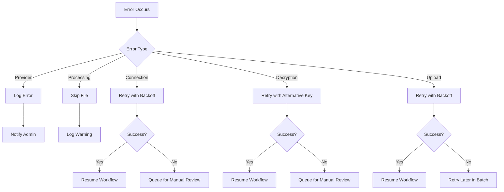

# File Processing Workflow

## Introduction

The file processing workflow is a central component of the Octo system, responsible for downloading, decrypting, processing, and storing files from various providers. This document details the end-to-end file processing workflow and each step involved.

## Overall Workflow


The workflow begins when a job is triggered via the API, which results in a call to the `start_logic` function with a provider name. The function then orchestrates the entire file processing workflow.

## Main Logic Implementation

The main orchestration logic is implemented in the `start_logic` function:

```python
async def start_logic(queue: asyncio.Queue, provider_str: str):
  try:
    start_time = time.time()
    data = get_env_data()
    print('start logic')

    providerObject = ProviderFactory(provider_str)
    provider = providerObject.get_provider(data)

    if provider:
      await provider.connect()
      files = await provider.fetch_files()
      decrypted_files = await provider.decrypt_files(files)
      processed_files = await provider.process_files(decrypted_files)
      await provider.upload_files(processed_files)

    end_time = time.time()
    print(f"Logic completed in {end_time - start_time} seconds")
    return {"status": "success"}
  except Exception as e:
    print(f"Error in start_logic: {str(e)}")
    return {"status": "error", "message": str(e)}
```

## Detailed Workflow Steps

### 1. Determine Files to Process

```mermaid
flowchart TB
    start[Start] --> config[Load Provider Configuration]
    config --> pattern[Determine File Patterns]
    pattern --> list[List Available Files]
    list --> filter[Filter by Date/Pattern]
    filter --> end[Return File List]
```

The system determines which files to process based on:
- Provider configuration
- Date patterns (e.g., files from yesterday)
- File naming patterns (e.g., "transaction_*.csv")
- File status (processed/unprocessed)

### 2. Download Files from Provider

```mermaid
flowchart TD
    start[Start Download Process] --> check{Connection\nEstablished?}
    check -->|No| connect[Connect to Provider]
    connect --> retry{Connection\nSuccessful?}
    retry -->|No| fail[Return Error]
    retry -->|Yes| download[Download Files]
    check -->|Yes| download
    download --> store[Store in Temp Location]
    store --> validate[Validate Downloaded Files]
    validate --> end[Return File Paths]
```

Download process details:
- Establishes secure connection to provider (SFTP/API)
- Downloads files to temporary location
- Validates file integrity (checksum verification)
- Records download metadata (timestamp, size, etc.)

### 3. Decrypt Files

```mermaid
flowchart TD
    start[Start Decryption] --> check{Files\nEncrypted?}
    check -->|No| skip[Skip Decryption]
    check -->|Yes| keys[Load GPG Keys]
    keys --> decrypt[Decrypt Files]
    decrypt --> validate[Validate Decryption]
    validate --> success{Decryption\nSuccessful?}
    success -->|No| retry[Retry Decryption]
    retry --> success
    success -->|Yes| store[Store Decrypted Files]
    skip --> end[Return File Paths]
    store --> end
```

Decryption details:
- Checks if files are encrypted (GPG)
- Loads appropriate decryption keys
- Performs decryption
- Verifies successful decryption
- Handles decryption failures with retries

### 4. Process Files

```mermaid
flowchart TD
    start[Start Processing] --> check{Processing\nNeeded?}
    check -->|No| skip[Skip Processing]
    check -->|Yes| determine[Determine File Type]
    determine --> csv{File Type}
    csv -->|CSV| processCsv[Process CSV]
    csv -->|XML| processXml[Process XML]
    csv -->|ZIP| unzip[Unzip Files]
    csv -->|Other| custom[Custom Processing]
    processCsv --> validate[Validate Output]
    processXml --> validate
    unzip --> determine
    custom --> validate
    validate --> store[Store Processed Files]
    skip --> end[Return File Paths]
    store --> end
```

Processing details:
- File type detection
- Format-specific processing (CSV parsing, XML transformation)
- Decompression for archive files
- Data transformation and normalization
- Schema validation

### 5. Upload to S3

```mermaid
flowchart TD
    start[Start Upload] --> configure[Configure S3 Client]
    configure --> structure[Determine S3 Path Structure]
    structure --> upload[Upload Files to S3]
    upload --> metadata[Add Metadata]
    metadata --> verify[Verify Upload]
    verify --> success{Upload\nSuccessful?}
    success -->|No| retry[Retry Upload]
    retry --> upload
    success -->|Yes| cleanup[Clean Temp Files]
    cleanup --> end[Complete]
```

Upload details:
- Organizes files in a structured S3 path
- Includes metadata and tagging
- Verifies successful uploads
- Handles upload failures with retries
- Cleans up temporary files after successful upload

## Error Handling and Recovery



The system implements robust error handling:
- Categorized error types with specific handling strategies
- Retry mechanisms with exponential backoff
- Detailed error logging
- Admin notifications for critical failures
- Recovery points to resume processing
